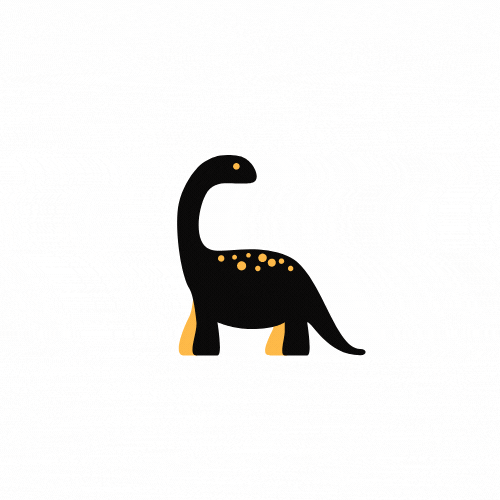

<p align="center">
  <a href="https://beta.victorgomez.dev">
    
  </a>
</p>

### **General info**
Hi 👋! This is my personal portfolio that I usually update every year (thus I'll probably change this repo's name later). 

The website is generated using NextJS (opted for it instead of Gatsby) SSG and some of the pages use ISG/SSR for some content to be displayed. 

Hope you like it 😄!

---
### **Technologies**
Project is created with:
* Next server side rendering framework: v12.1.5
* Linaria no runtime css-in-js lib: v2.3.1
* GraphQl query language: v16.4.0
* GraphQl code generation (grpahql-codegen): v2.6.2
* Preact: still going to be added
* For other secondary libs/fmwk and Gatsby plugins, give a look into [package.json file](https://github.com/Vicg853/portfolio-2.2/blob/main/package.json)

---
### **Setup**
  > Note: Node version >= 14.x must be installed in your local environment

  *After downloading/cloning the repository and assuring yourself you are allowed to copy this repo...*

  * **Before running...**
    > ... add at least a ``` .env.dev ``` file with the following minimum required variables
  ```.env
    NEXT_PUBLIC_SITE_URL='http://localhost:3000'
  ```

  * **...Development**
  ```bash
   cd ./portfolio-2.2
   yarn dev 
  ```

  * **...Production**
  ```bash
   cd ./portfolio-2.2
   yarn prod
  ```

  * Access:
  **Voila, now, you're ready to access it via [``` localhost:3000 ```](http://localhost:3000)**

---

### **Testing**
Still not implemented...

---

### **Credits**
Contributors: [@vicg853](https://github.com/Vicg853)

Special thanks to techs/teams: 
- of NodeJS's for an amazing runtime env
- at Next for the magic with site generation framework
- linaria for an amazing css-in-js with such low compromises
- facebook for such an easy tool to create scalable API (graphql)
- all the other people that developed the other libs/fmwrks and plugins
